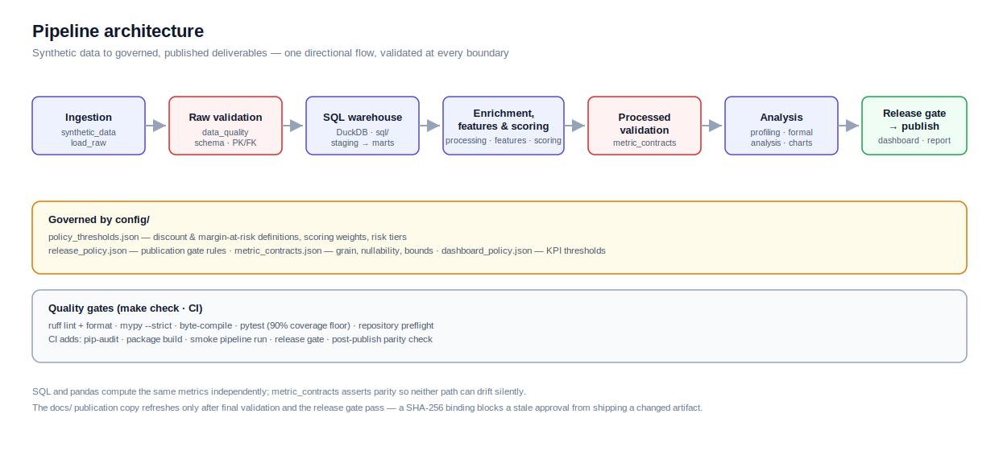

# Architecture

This document explains how the pieces fit together. For metric definitions see
[docs/data_dictionary.md](docs/data_dictionary.md); for the operating checklist see
[docs/operations_runbook.md](docs/operations_runbook.md).



## Design principles

1. **Reproducibility first.** The same seed and parameters yield equivalent analytical
   outputs. Dates are derived from the data, not from wall-clock time.
2. **Governed policy over magic numbers.** Decision thresholds, score weights, release
   rules, and data contracts live in `config/`. Exploratory classification cutoffs are
   named in their analytical module rather than hidden inside expressions.
3. **Validate at every boundary.** Raw data is validated before SQL marts are built;
   pandas joins carry explicit cardinality contracts; a release gate guards publication.
4. **Layered, one-directional flow.** Each `src/` package depends only on layers beneath
   it. No analysis code reaches back into ingestion internals.

## Layered modules (`src/`)

```
ingestion/    synthetic_data, load_raw          raw synthetic tables -> data/raw
processing/   build_base_tables, sql_warehouse  DuckDB marts + enriched pandas facts
features/     pricing_features                  per-order-item pricing metrics
scoring/      risk_scoring                       customer governance priority score
validation/   data_quality, metric_contracts,   schema/PK-FK/reconciliation checks,
              final_review, release_gate         SQL/Python parity, publication gate
analysis/     data_profiling, formal_analysis,  governed marts -> reports, charts,
              visualization_pack, dashboard_builder  dashboard
utils/        paths, io, policy                  path safety, safe I/O, config loading
```

`utils/` is the shared foundation: `paths` enforces a project-root boundary, `io`
validates types and table names before touching the filesystem, and `policy` loads and
validates `config/policy_thresholds.json` (weights must sum to 1, tiers strictly
descending, etc.) behind an `lru_cache`.

## Data flow

```
synthetic data
  -> raw validation              (validation/data_quality)
  -> DuckDB SQL warehouse        (processing/sql_warehouse, sql/)
  -> pandas enrichment           (processing/build_base_tables)
  -> feature engineering         (features/pricing_features)
  -> risk scoring                (scoring/risk_scoring)
  -> processed validation        (validation/data_quality, metric_contracts)
  -> analysis & visualization    (analysis/*)
  -> dashboard candidate         (analysis/dashboard_builder)
  -> final cross-output review   (validation/final_review)
  -> release gate                (validation/release_gate)
  -> dashboard publication       (scripts/publish_pages_dashboard)
```

The orchestrator is [`scripts/run_pipeline.py`](scripts/run_pipeline.py), which wires the
layers together and writes runtime artefacts to `outputs/` and `data/processed/`.
The public `docs/` copy is refreshed only after the final validation and release gate pass.
The publisher also verifies the dashboard SHA-256 recorded by the gate, preventing a stale
approval from authorizing a changed artifact.
The run manifest records its schema version, input configuration, runtime versions,
repository-relative artifact paths, row counts, release state, publication status, and
pipeline duration.

## SQL warehouse (`sql/`)

DuckDB models are organized as `staging -> intermediate -> marts`, mirroring a warehouse.
The same metrics are computed in both SQL and pandas; `validation/metric_contracts`
asserts parity between the two so neither path can drift silently.

## Configuration (`config/`)

| File | Owns |
|---|---|
| `policy_thresholds.json` | discounted/high-discount and margin-at-risk definitions, sensitivity range, scoring weights, risk tiers, pricing-health bands |
| `release_policy.json` | conditions the release gate enforces before publication |
| `metric_contracts.json` | table grains, required fields, nullability, bounds, and controlled taxonomies |
| `dashboard_policy.json` | KPI warning and critical posture thresholds |

## Quality gates

The network-independent local gate (`make check`) runs ruff lint and format checks,
mypy, byte-compilation, pytest with a 90% coverage floor, and repository preflight.
CI adds dependency auditing, environment integrity, package build, a smoke pipeline run,
the release gate, and a post-pipeline publication parity check. See
[CONTRIBUTING.md](CONTRIBUTING.md).

## Outputs

Runtime CSV/JSON/Markdown tables and processed marts are reproducible and git-ignored.
The reviewable release artefacts — dashboard HTML, PDF report, and publication chart pack
— are versioned. See [outputs/README.md](outputs/README.md) for the exact allowlist.
