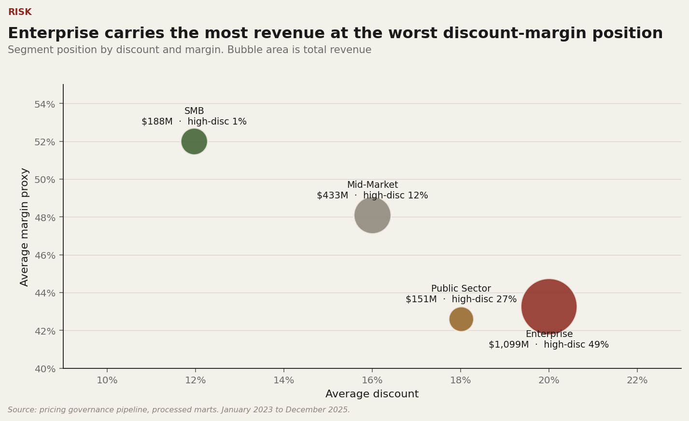

# Pricing Discipline & Discount Governance

Reproducible pricing governance analytics for detecting discount leakage, quantifying margin exposure, and prioritizing customer interventions across a B2B revenue book.

[](https://github.com/mfidalgomartins/pricing-discount-governance-system/actions/workflows/ci.yml)


**[Live dashboard](https://mfidalgomartins.github.io/pricing-discount-governance-system/)** · **[Analytical report (PDF)](outputs/reports/pricing_discount_governance_report.pdf)**



## Business Problem

Discount-led growth can look healthy while quietly reducing price realization and margin quality. This project builds a governed analytics layer that separates sustainable pricing performance from structural discount dependency across customers, segments, products, channels, regions, and sales reps.

The published baseline covers **38,349 order lines**, **1,173 transacting customers**, and **$1.87B synthetic revenue** from **January 2023 to December 2025**.

## What It Delivers

- Reproducible commercial dataset with documented grain and lineage.
- Python and DuckDB SQL pipeline from raw data to governed marts.
- Data quality checks for schema, PK/FK integrity, row-count gates, bounds, reconciliation, and no-silent-drop joins.
- Operational customer risk score with documented thresholds and caveats.
- Sensitivity analysis around the governed high-discount threshold.
- Accessible HTML dashboard with embedded analytical data and a versioned local Chart.js asset.
- Publication chart pack and a 33-page analytical PDF report.
- Focused documentation for technical review.

## Dataset & Grain

| Layer | Main tables | Grain |
|---|---|---|
| Raw synthetic data | `customers`, `products`, `sales_reps`, `orders`, `order_items` | dimensions, order headers, and order lines |
| Processed pandas facts | `order_item_enriched`, `order_item_pricing_metrics` | one row per order item |
| Analytical aggregates | `customer_pricing_profile`, `segment_pricing_summary`, `customer_risk_scores` | customer, segment, and risk-score grains |
| SQL marts | `mart_customer_pricing_profile`, `mart_segment_pricing_summary`, `mart_overall_pricing_health` | warehouse-ready decision views |

See [docs/data_dictionary.md](docs/data_dictionary.md) for table definitions, keys, metrics, units, and synthetic-data caveats.

## Pipeline

```text
synthetic data
  -> raw validation
  -> DuckDB SQL warehouse
  -> pandas enrichment
  -> feature engineering
  -> risk scoring
  -> processed validation
  -> analysis and visualization
  -> dashboard publication
  -> release gate
```

The pipeline validates raw data before building SQL marts, validates pandas joins with explicit cardinality contracts, and uses data-derived dates so repeated runs with the same seed produce equivalent analytical outputs.

## Key Metrics

- `weighted_realized_discount`: list-revenue-weighted discount leakage.
- `price_realization`: realized revenue divided by list revenue.
- `high_discount_revenue_share`: revenue share from lines at or above the high-discount threshold.
- `margin_proxy_pct`: modeled margin proxy from synthetic unit cost.
- `realized_price_residual_pct`: product/channel-normalized price residual for pricing inconsistency diagnostics.
- `governance_priority_score`: operational score blending pricing risk, discount dependency, and margin erosion.

## Run Locally

```bash
make install   # create .venv and install pinned dependencies
make run       # full pipeline — 1200 customers, 18 000 orders
make report    # rebuild the publication chart pack and PDF report
make test      # pytest with coverage
make preflight # repository health check
```

Or without `make`:

```bash
python3 -m venv .venv && . .venv/bin/activate
pip install -r requirements.lock
python scripts/run_pipeline.py
python scripts/build_report_assets.py
python scripts/build_report_pdf.py
pytest -q -p no:cacheprovider
python scripts/preflight_check.py
```

For a faster smoke run:

```bash
make run-smoke
# equivalent to:
# python scripts/run_pipeline.py --seed 11 --customers 220 --products 28 \
#   --sales-reps 14 --orders 2400 --start-date 2024-01-01 --end-date 2024-12-31
```

The base `high_discount_flag` threshold and its sensitivity range are defined separately in `config/policy_thresholds.json`. Python, SQL, reports, and visualizations consume the same base threshold.

## Outputs

- Local dashboard output: `outputs/dashboard/pricing-discipline-command-center.html`
- GitHub Pages dashboard copy: `docs/pricing-discipline-command-center.html`
- GitHub Pages entrypoint: `docs/index.html`
- Analytical report: `outputs/reports/pricing_discount_governance_report.pdf`
- Publication chart pack: `outputs/graphs/`
- Runtime outputs: regenerated locally under `outputs/`
- Processed tables and SQL marts: regenerated locally under `data/processed/`

Runtime tables and processed marts are intentionally ignored because they are reproducible. The dashboard, report, and publication chart pack are versioned as reviewable release artefacts.

## Tests & Quality Gates

```bash
make lint      # compile-check all Python modules
make test      # pytest with coverage
make preflight # required-file and artifact checks
```

Coverage focuses on raw validation order, pandas merge integrity, SQL/Python metric parity, weighted margin reconciliation, deterministic dates, CLI guards, metric contracts, release gates, visualization outputs, and dashboard HTML/accessibility contracts.

## Repository Map

```text
config/       policy thresholds, release policy, metric contracts
data/         synthetic raw inputs and generated processed data
docs/         GitHub Pages dashboard and project documentation
scripts/      pipeline, dashboard, publishing, and release commands
sql/          DuckDB staging, intermediate, and mart models
src/          ingestion, processing, features, scoring, validation, analysis
tests/        pytest regression and quality checks
outputs/      local runtime reports and charts
```

## Methodological Limits

- Synthetic data supports methodology validation, not real-world commercial attribution.
- Margin is a modeled proxy, not audited accounting gross margin.
- Risk scores are operational heuristics and should not be treated as validated prediction models.
- Outlier and inconsistency signals flag review priorities, not misconduct.
- Realized-price variance can reflect product/channel mix; residual metrics are preferred for pricing inconsistency.

## License

MIT. See [LICENSE](LICENSE).
