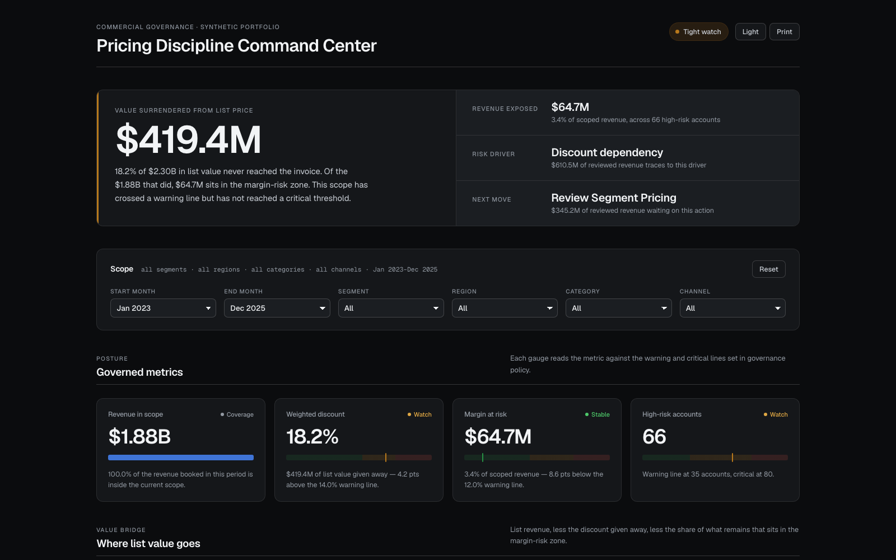
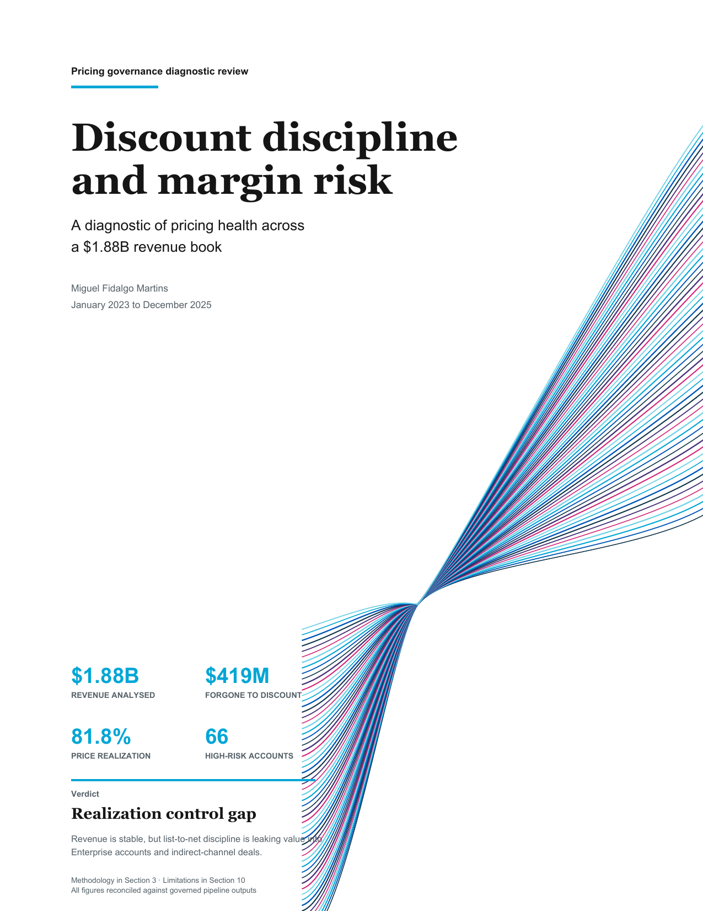

# Pricing Discipline & Discount Governance

Reproducible pricing governance analytics for detecting discount leakage, quantifying margin exposure, and prioritizing customer interventions across a B2B revenue book.

[](https://github.com/mfidalgomartins/pricing-discount-governance-system/actions/workflows/ci.yml)


**[▶ Open the live dashboard](https://mfidalgomartins.github.io/pricing-discount-governance-system/)** · **[▤ Read the executive report (PDF)](outputs/reports/pricing_discount_governance_report.pdf)** · **[Architecture](ARCHITECTURE.md)**

## Flagship Deliverables

Two artifacts carry the analysis to a decision-maker. Both are generated by the pipeline in
this repository from the same governed metrics — not hand-edited, not a one-off export.

<table>
<tr>
<td width="50%" valign="top">

**[Pricing Discipline Command Center](https://mfidalgomartins.github.io/pricing-discount-governance-system/)**
*the interactive dashboard*

[](https://mfidalgomartins.github.io/pricing-discount-governance-system/)

A single-file, dependency-pinned HTML dashboard built for a pricing governance review, not a
generic BI export.

- Headline KPI band (value surrendered from list price, revenue exposed at risk, primary
  risk driver, next recommended action) framed as an executive read, not a chart wall.
- Governed gauges that plot each metric against its warning/critical policy line, so risk
  posture is visible without a legend.
- Segment, region, category, channel, and month filters that recompute every view from the
  same embedded dataset — no server, no build step, works offline from a single file.
- Drill-down account tables (critical/high-risk queue) tied to the same discount and margin
  thresholds enforced upstream by the release gate.

</td>
<td width="50%" valign="top">

**[Pricing & Discount Governance Report](outputs/reports/pricing_discount_governance_report.pdf)**
*the executive report*

[](outputs/reports/pricing_discount_governance_report.pdf)

A 34-page analytical PDF built with the same governed metrics as the dashboard, structured
for offline review and distribution.

- Executive summary with the headline findings, verdict, and governed thresholds up front.
- Segment, channel, region, and product breakdowns with the charts in `outputs/graphs/`.
- A validation appendix documenting every data-quality and reconciliation check the release
  had to pass before publication.
- Numbers in the PDF, the dashboard, and this README are generated from one pipeline run —
  see [CHANGELOG.md](CHANGELOG.md) for the reproducibility note behind that guarantee.

</td>
</tr>
</table>

## Business Problem

Discount-led growth can look healthy while quietly reducing price realization and margin quality. This project builds a governed analytics layer that separates sustainable pricing performance from structural discount dependency across customers, segments, products, channels, regions, and sales reps.

The published baseline covers **38,391 order lines**, **1,173 transacting customers**, and **$1.88B in revenue** from **January 2023 to December 2025**.

## What It Delivers

- Reproducible commercial dataset with documented grain and lineage.
- Python and DuckDB SQL pipeline from raw data to governed marts.
- Data quality checks for schema, PK/FK integrity, row-count gates, bounds, reconciliation, and no-silent-drop joins.
- Operational customer risk score with documented thresholds and caveats.
- Sensitivity analysis around the governed high-discount threshold.
- Accessible HTML dashboard with embedded analytical data and a versioned local Chart.js asset.
- Publication chart pack and a 34-page analytical PDF report.
- Focused documentation for technical review.

## Published Findings

For the reproducible synthetic baseline:

- Price realization is **81.8%**, equivalent to an **18.2% weighted discount** and $419M of modeled list-to-net concession over three years.
- **33.4% of revenue** is generated by lines at or above the governed 20% high-discount threshold.
- Enterprise represents **$1.10B / 58.6% of revenue** and carries the weakest segment-level discount-margin position.
- The reseller channel discounts at **21.0%**, versus **14.4% online**; the critical and high-risk account queue contains **66 customers / $267M revenue**.

## Dataset & Grain

| Layer | Main tables | Grain |
|---|---|---|
| Raw synthetic data | `customers`, `products`, `sales_reps`, `orders`, `order_items` | dimensions, order headers, and order lines |
| Processed pandas facts | `order_item_enriched`, `order_item_pricing_metrics` | one row per order item |
| Analytical aggregates | `customer_pricing_profile`, `segment_pricing_summary`, `customer_risk_scores` | customer, segment, and risk-score grains |
| SQL marts | `mart_customer_pricing_profile`, `mart_segment_pricing_summary`, `mart_overall_pricing_health` | warehouse-ready decision views |

See [docs/data_dictionary.md](docs/data_dictionary.md) for table definitions, keys, metrics, units, and synthetic-data caveats.

## Pipeline


The pipeline validates raw data before building SQL marts, validates pandas joins with explicit cardinality contracts, and uses data-derived dates so repeated runs with the same seed produce equivalent analytical outputs. Full component-level detail is in [ARCHITECTURE.md](ARCHITECTURE.md).

## Key Metrics

- `weighted_realized_discount`: list-revenue-weighted discount leakage.
- `price_realization`: realized revenue divided by list revenue.
- `high_discount_revenue_share`: revenue share from lines at or above the high-discount threshold.
- `margin_proxy_pct`: modeled margin proxy from synthetic unit cost.
- `price_realization_residual_pct`: deviation from the product/channel peer price-realization baseline, controlling for list-price level.
- `governance_priority_score`: operational score blending pricing risk, discount dependency, and margin erosion.

## Run Locally

```bash
make install   # create .venv and install pinned dependencies
make run       # full pipeline — 1200 customers, 18 000 orders
make report    # rebuild the publication chart pack and PDF report
make test      # pytest with coverage
make audit     # scan pinned dependencies for known vulnerabilities
make preflight # repository health check
```

Or without `make`:

```bash
python3 -m venv .venv && . .venv/bin/activate
pip install -r requirements.lock
python scripts/run_pipeline.py
python scripts/build_report_assets.py
python scripts/build_report_pdf.py
pytest -q -p no:cacheprovider
python scripts/preflight_check.py
```

For a faster smoke run:

```bash
make run-smoke
# equivalent to:
# python scripts/run_pipeline.py --seed 11 --customers 220 --products 28 \
#   --sales-reps 14 --orders 2400 --start-date 2024-01-01 --end-date 2024-12-31
```

Governed discount, margin-at-risk, scoring, pricing-health, and sensitivity thresholds are defined in `config/policy_thresholds.json`. Python, SQL, reports, and dashboard data shaping consume the applicable shared policy values.

## Operational Runbook

Use [docs/operations_runbook.md](docs/operations_runbook.md) for the practical operating checklist: environment setup, deterministic run settings, data-contract requirements, validation triage, release gate, privacy notes, and publication steps.

Minimum production-style workflow:

```bash
make install
make run-smoke
make lint
make test
make preflight
```

Before publishing reviewable artifacts, run:

```bash
make run
make report
python scripts/release_gate.py
make preflight
```

Do not publish if `outputs/final_validation_summary.json`, `outputs/release/release_gate_report.json`, or any validation CSV reports failed checks. Runtime CSV/JSON/Markdown outputs are reproducible and ignored by git unless explicitly listed in [outputs/README.md](outputs/README.md).

## Outputs

- Local dashboard output: `outputs/dashboard/pricing-discipline-command-center.html`
- GitHub Pages dashboard copy: `docs/pricing-discipline-command-center.html`
- GitHub Pages entrypoint: `docs/index.html`
- Analytical report: `outputs/reports/pricing_discount_governance_report.pdf`
- Publication chart pack: `outputs/graphs/`
- Runtime outputs: regenerated locally under `outputs/`
- Processed tables and SQL marts: regenerated locally under `data/processed/`

Runtime tables and processed marts are intentionally ignored because they are reproducible. The dashboard, report, and publication chart pack are versioned as reviewable release artefacts.

## Tests & Quality Gates

```bash
make check        # full local gate: lint, format-check, types, compile, tests, preflight
```

Or run the stages individually:

```bash
make lint         # ruff lint (style + correctness)
make format       # ruff auto-format (line length 100)
make typecheck    # mypy on src
make test         # pytest with a 90% coverage gate
make audit        # pip-audit against the pinned dependency set
make preflight    # required-file and artifact checks
```

Coverage focuses on raw validation order, pandas merge integrity, SQL/Python metric parity, weighted margin reconciliation, deterministic dates, CLI guards, metric contracts, release gates, visualization outputs, path/IO safety boundaries, and dashboard HTML/accessibility contracts.

CI runs install, dependency vulnerability audit, lint, format-check, type-check, compile and package-build checks, repository preflight, unit tests with the coverage gate, a smoke pipeline run, the release gate, and a post-pipeline publication parity check. Local release candidates should pass `make check` and `make audit` before updating dashboard/report artifacts. See [CONTRIBUTING.md](CONTRIBUTING.md) for the contributor workflow and [ARCHITECTURE.md](ARCHITECTURE.md) for the system design.

## Repository Map

```text
config/       policy thresholds, release policy, metric contracts
data/         synthetic raw inputs and generated processed data
docs/         GitHub Pages dashboard and project documentation
scripts/      pipeline, dashboard, publishing, and release commands
sql/          DuckDB staging, intermediate, and mart models
src/          ingestion, processing, features, scoring, validation, analysis
tests/        pytest regression and quality checks
outputs/      local runtime reports and charts
```

## Roadmap

Near-term work, in priority order:

- Holdout backtesting for the governance priority score, to move risk-tier validation
  beyond in-sample sensitivity analysis.
- Channel- and region-level drill-down views in the dashboard, extending today's
  segment-level filters to the same grain used in `mart_segment_pricing_summary`.
- CI diffing of the PDF report and dashboard against the previous release, to flag
  unexpected figure drift automatically instead of relying on manual review at publish time.
- A second synthetic scenario (recessionary discount pressure) to stress-test the release
  gate's thresholds against a materially different pricing environment.

## Methodological Limits

- Synthetic data supports methodology validation, not real-world commercial attribution.
- Monetary values are modeled in USD for presentation consistency; they are not real-company results.
- Margin is a modeled proxy, not audited accounting gross margin.
- Risk scores are operational heuristics and should not be treated as validated prediction models.
- Outlier and inconsistency signals flag review priorities, not misconduct.
- Realized-price variance can reflect product/channel mix; residual metrics are preferred for pricing inconsistency.

## License

MIT. See [LICENSE](LICENSE).
